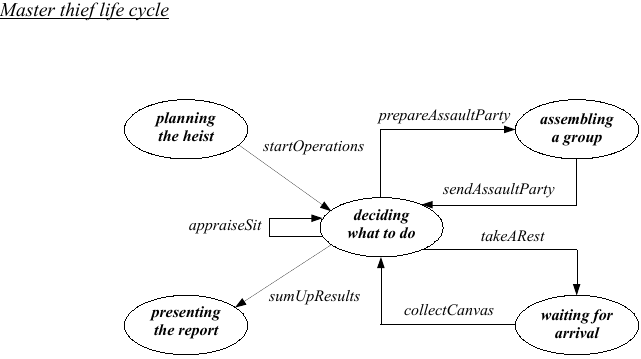
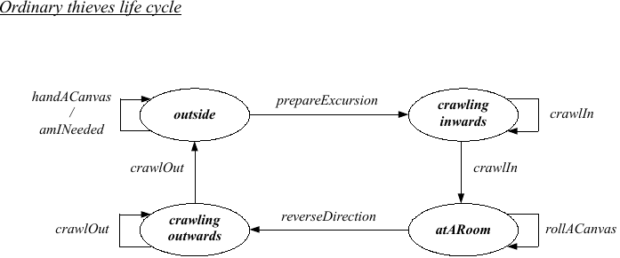

# HeistToTheMuseum

HeistToTheMuseum was developed at [Aveiro University](https://www.ua.pt) in the course [40814-Distributed Systems](http://www.ua.pt/ensino/uc/2855) for academic purposes and intents to demonstrate the steps needed to implement 3 computationally distributed solutions of the "Heist To The Museum".

## What is "Heist to the museum"?

A group of M thieves plans to steal the paintings in exhibition at a museum in Aveiro. The paintings
are in display in N different rooms, each having Qi paintings hanging on the walls, with i = 0, 1, ... , N-1.
The operation is directed by the master thief who organizes her companions, standing in queue while
waiting to be summoned, in assault parties of K elements and assigns to each party a target room in the
museum. Different parties may proceed to different rooms at the same time. In the end, the master thief
calls a meeting and informs the rest of the thieves about the sack earnings.
To prevent detection by the museum guards, the thieves forming a party crawl in line, as fast and as
silently as they possibly can, along a previously established path between the outside gathering site and
the target room. They must ensure that contiguous elements in the crawling line are not separated by a
distance larger than a previously fixed value. Upon arrival at a museum room, each party member looks
for a painting still hanging on the wall and, if there is one, he takes it down, detaches the canvas from the
framing, rolls it over and inserts it in a cylinder container he carries on his back. He then prepares to leave
the room. The way out is the same as the way in and the crawling procedure adopted before is adopted
again. When a thief reaches the outside location where the master thief is hiding, he takes the canvas out
of the cylinder and hands it to the master thief who stores it in the back of a van, or tells her he is coming
empty-handed. Since the master thief does not know beforehand how many paintings are hanging in the
walls of each room, she goes on promoting incursions to the same room until she is sure the room is
empty.
The crawling movement of party Gj, with j = 0, 1, ... , (M-1)/K-1, requires successive increments of
position that obey the following rules
* the ingoing movement (outside gathering site to museum room) is performed by taking positive
position increments and the outgoing movement (museum room to outside gathering site) is
performed by taking negative position increments
* the distance between the outside gathering site and the museum room i is Di length units, with
i = 0, 1, ... , N-1
* the ingoing movement only starts when all group members have been selected and are ready to
proceed, the outgoing movement only starts when all group members have taken a canvass or are
empty-handed, because no more paintings are hanging in the room walls
* the thieves in a party crawl in line, can overtake one another, but can never stay side by side, nor
be separated by a distance larger than S length units
* at each iteration step, the thief tj, with j = 1, ... , M-1, can change his position from 1 to MDl length
units, always moving as fast as he possibly can without violating the constraints imposed by the
previous rule
* the maximum displacement, MDt , is specific to each thief tj, the thieves are not all equal, some are
more agile and faster than others.

Assume there are 7 thieves in the whole, master included, the maximum displacement of the ordinary
thieves is a random number between 2 and 6, the number of exhibition rooms having paintings in display
is 5 with random distances to the outside gathering site between 15 and 30, the number of paintings
hanging in each room is a random number between 8 and 16 and that the assault parties have 3 elements.
Also assume that the maximum separation limit between thieves crawling in line is 3 length units.
Write a simulation of the life cycle of the thieves using one of the models for thread communication
and synchronization which have been studied: monitors or semaphores and shared memory.
One aims for a distributed solution with multiple information sharing regions that has to be written in
Java, run in Linux and terminate.
A logging file, which describes the evolution of the internal state of the problem in a clear and precise
way, must be included.

## 3 Solutions

There are three solutions presented in this repository:
* **1.** Using java Synchronized Methods to implement the shared areas/variables and Thread class to use threads and perform actions(concurrency) within shared areas. *(Monitors)*
* **2.** Implemented a client-server approach that active entities trade messages with passive entities.
	This solution tries to demonstrate a simple simulation how java’s RMI works using messages over TCP sockets. *(Messages)*
* **3.** Implementation of a full java RMI solution where shared areas are registered and players *(RMI)*

Each solution produces a logging file with all the details.
For the second and third solution it was developed a script in python 3.5 to run the solution on a set of specified machines.

## Threads life cycle (active entities)
### Master Thief life cycle

### Ordinary Thief life cycle

## Passive entities 
- Concentration Site
- Control Collection Site
- Museum
- Assault Party #0
- Assault Party #1
- Logger

## Licence

MIT
